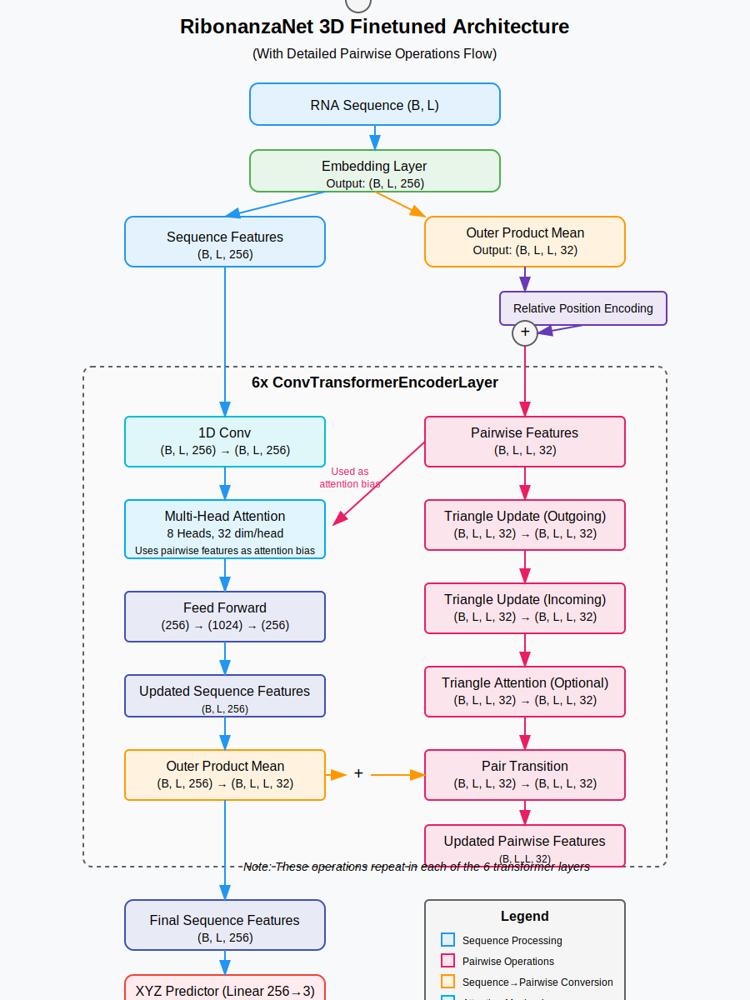

[Notebook quicklink](https://github.com/my-Iq-is-3/beta-fold/blob/main/proj/beta-fold.ipynb)
# beta-fold
Entry for stanford-rna-3d-folding Kaggle competition (https://www.kaggle.com/competitions/stanford-rna-3d-folding)

# TODO
1. Find more data
2. Test structure normalization -> rescaling networks 
3. Test squeezeformer
4. Test Ribonanzanet (secondary structures) -> alphafold -> tertiary structure
5. Research and brainstorm
6. Think about n-gon custom updates/attention (similar to triangle updates but with more (n) attending nodes)

# Reference Links
1. Synthetic RNA structures: https://www.kaggle.com/datasets/andrewfavor/uw-synthetic-rna-structures/data
2. Base model we are building off of: https://github.com/Shujun-He/RibonanzaNet
3. Base model presentation: https://www.youtube.com/watch?v=u6msaNZyfSk
4. Secondary model presentation (to integrate improvements from): https://www.youtube.com/watch?v=n4zz9nY4uGU
5. [Whiteboard]( https://wbd.ms/share/v2/aHR0cHM6Ly93aGl0ZWJvYXJkLm1pY3Jvc29mdC5jb20vYXBpL3YxLjAvd2hpdGVib2FyZHMvcmVkZWVtL2FjY2EwYmI4Y2M0MjQ3YWJhNDY5Zjk0MDBmZTljYjZkX0JCQTcxNzYyLTEyRTAtNDJFMS1CMzI0LTVCMTMxRjQyNEUzRF9lZTJkNGViNC0wODE4LTQ4ZTktODAyMS1mYzQ2MzJkOGVkZjg=)

# MODEL ARCHITECTURE

